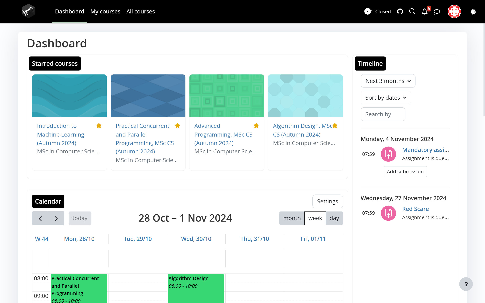
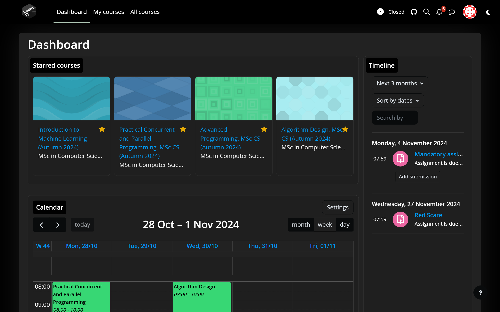
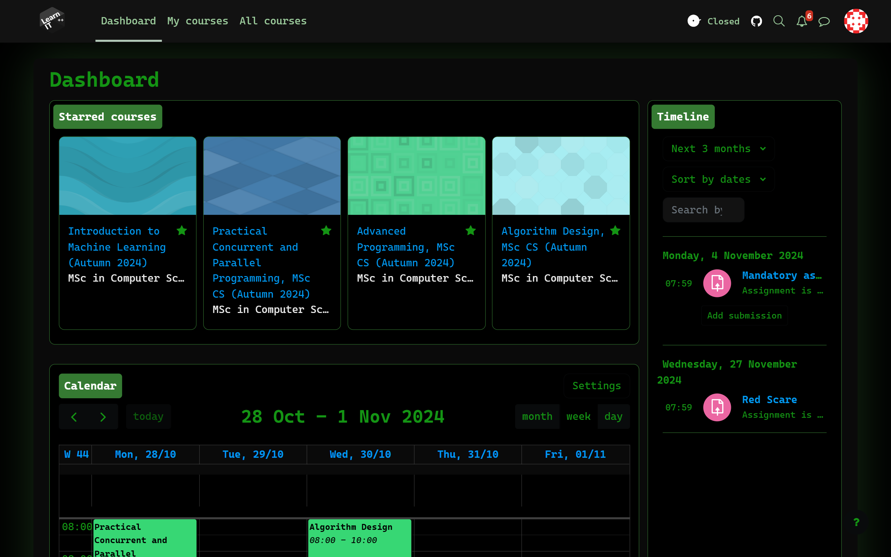
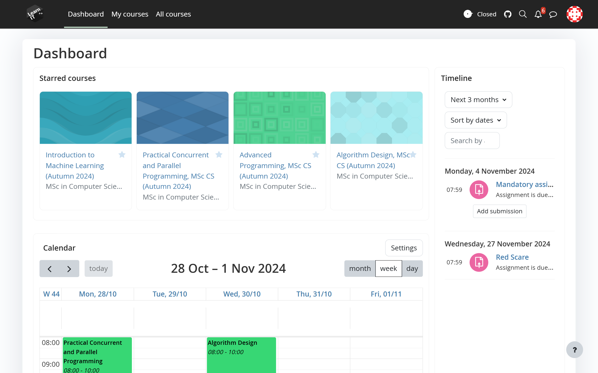

# LearnIT++

**Welcome to LearnIt++ Extension!**

|  |  |
| --- | --- |
|  |  |

## Description

Improved design and functionality of the LearnIT page for IT-University Of Copenhagen

## Installation

There is currently no web store download, but adding local extensions is pretty easy.

**Chrome/chromium guide:**

Install via [Chrome Web Store](https://chrome.google.com/webstore/detail/learnit%2B%2B/dgljcacndcbaedcglhlibdhohipphojk/)

_Manual install:_
To install LearnIt++, follow these simple steps:

1. Download the latest zip from the [releases](https://github.com/PhilipFlyvholm/learnit-plus-plus/releases) on GitHub.
2. Unpack the zip
3. Go to `chrome://extensions` in your browser
4. Enable developer mode in the top right
5. Press `Load unpacked` and select the unpacked zip
6. Enjoy!

**Firefox guide:**

Only manual install since Firefox does not allow add-ons on the store for internal sites such as LearnIT

1. Download the latest `xpi` file from the [releases](https://github.com/PhilipFlyvholm/learnit-plus-plus/releases) on GitHub.
2. Go to `about:addons` in your browser
3. Pres the gear icon on the other side of "Customize Firefox"
4. Press `Install add-on from file...`
5. Select the downloaded `xpi` file
6. A popup may show up asking if you want to install the add-on, accept this popup.
7. Enjoy!

**Safari:**

There is currently no plan for safari support since you need an Apple dev license for this.

## Contributing

For contributing please read [CONTRIBUTING.md](./CONTRIBUTING.md).

## How to build

## Development

> [!NOTE]
> We use Bun instead of Node. If you prefer using Node we don't guarantee that building will work, but just replace `bun` with `npm run` in the commands.

1. Run `bun i` if it is the first time building
2. Run `bun dev` to start the development server
3. Open [https://learnit.itu.dk/my/](https://learnit.itu.dk/my/) and start making cool stuff 🪄

## Production

1. Use `bun build` to build the extension and make a local build in the `build/` folder
2. Use `bun package:chrome` to generate a zip in the `build/` folder for chrome
3. Use `bun package:firefox` for a Firefox zip package
4. Done time to distribute 🎉

## Support

If you have any questions or issues, please use the issues page on GitHub to report issues and discussions for questions and ideas.

## License

This project is licensed under the ISC License - see the [LICENSE](LICENSE) file for details.
